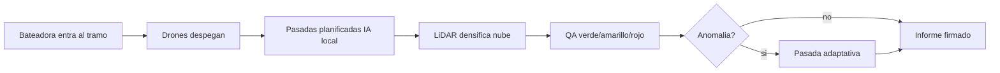
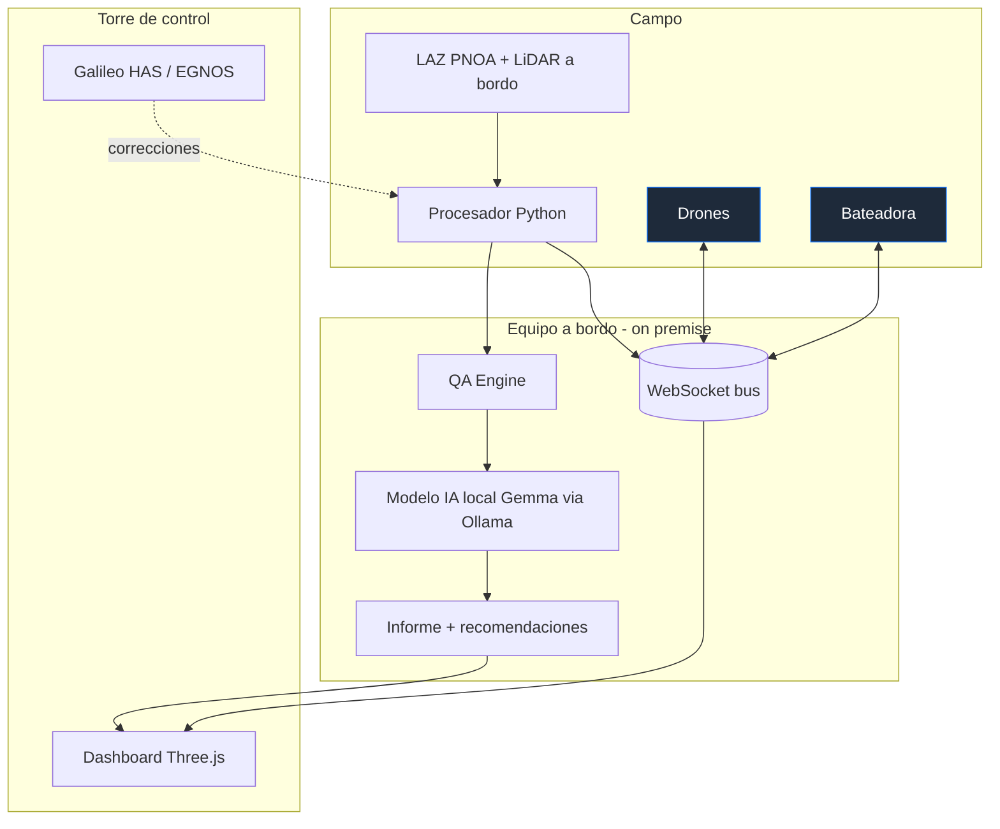
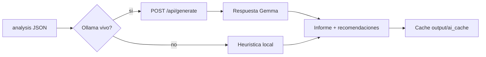
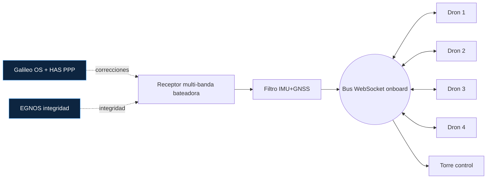
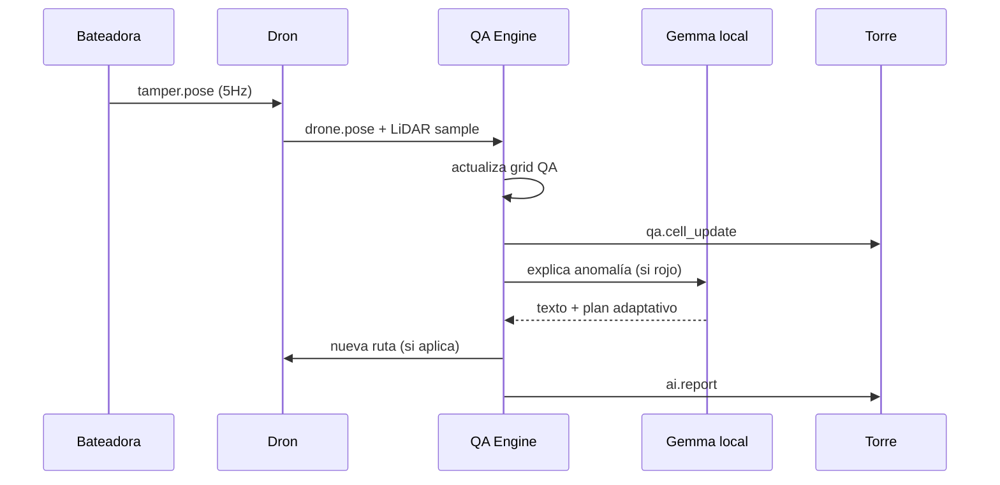
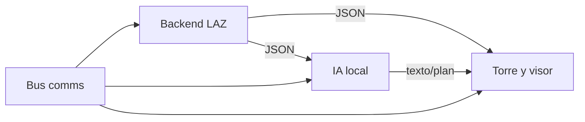
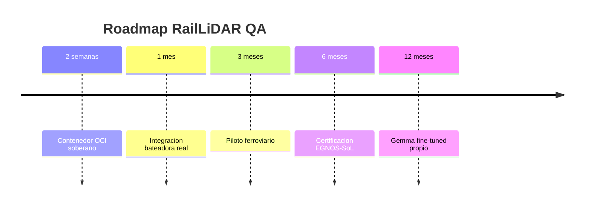

# RailLiDAR QA — Plan de Hackathon Ineco (6 horas)

> Documento de planificación táctica para construir, en una sola jornada, la
> mejor herramienta posible sobre el MVP `rail-lidar-qa-mvp`: drones de QA
> montados en bateadora con LiDAR PNOA, IA local (Gemma vía Ollama), Galileo
> HAS y torre de control. Pensado para superar el filtro de **60 pts de
> soberanía** y maximizar **Excelencia + Impacto + Implementación**.

---

## Índice

1. Resumen ejecutivo y propuesta de valor
2. Mapa del estado actual del repositorio
3. Visión del producto en 6 horas
4. Arquitectura objetivo
5. Plan hora a hora (Gantt + responsables)
6. Gestión integral de variables LAZ
7. Pipeline matemático: de la nube a la geometría de vía
8. Capa de IA local con Ollama / Gemma
9. Three.js: escena, capas y rendimiento
10. Comunicaciones: Galileo HAS ↔ bateadora ↔ drones
11. Torre de control: telemetría y “vía mejorando en vivo”
12. Modelo antes/después y métricas QA
13. Soberanía: cómo ganamos los 100 puntos
14. Entregables, memoria y política de IA generativa
15. Roles del equipo y reparto en 6h
16. Pruebas, validación y guion de demo
17. Riesgos y mitigaciones
18. Roadmap post-hackathon
19. Anexos: variables, comandos, prompts IA
20. Cierre y “check-list de campeón”

---

## 1. Resumen ejecutivo y propuesta de valor

### 1.1 Pitch en una frase

> **RailLiDAR QA** convierte cada paso de bateadora en un control de calidad
> milimétrico, soberano y reproducible, gracias a un enjambre de drones
> LiDAR montados en la propia máquina, IA local que interpreta la nube de
> puntos y una torre de control 3D que muestra la vía corrigiéndose en
> directo.

### 1.2 ¿Qué problema resuelve?

- La bateadora corrige geometría de vía pero **no documenta** el estado de
  forma trazable y comparable.
- Los datos LiDAR aéreos del PNOA existen y son gratuitos, pero **nadie los
  cruza** con la operación ferroviaria en tiempo real.
- Cualquier solución “cloud + IA externa” incumple los criterios de
  **soberanía tecnológica** del reto Ineco.

### 1.3 ¿Qué entregamos en 6 horas?

| Pilar | Entregable |
|-------|------------|
| Excelencia | Pipeline LAZ → geometría curva de vía → sección 3D → métricas QA, todo abierto y reproducible |
| Impacto | Reducción simulada de error residual de 72 → 30 mm, planificación adaptativa de drones, informe automático |
| Implementación | App local que arranca con un `.bat`, demo pública estática en Vercel/Pages, IA local con Ollama |
| Soberanía | Datos abiertos PNOA, modelo Gemma local, sin APIs externas en runtime, código auditado |

### 1.4 Estado de partida (commit actual)

- Corredor largo ferroviario Adamuz `900 × 240 m`, `4.327.268` puntos en ROI.
- Modelo de vía curva por ventanas longitudinales y sección transversal 3D.
- Drones con 4 pasadas, animación, anomalía simulada y bateadora que ya
  sigue el perfil curvo.
- Despliegues vivos:
  - GitHub Pages: `https://ntizar.github.io/rail-lidar-qa-mvp/`
  - Vercel: `https://docs-beta-nine.vercel.app`

---

## 2. Mapa del estado actual del repositorio

```text
2005/
├── PNOA_2020_AND-C_364-4212_ORT-CLA-IRC.laz   # tile activo (no se sube)
├── src/
│   ├── process_laz.py          # análisis LAZ, segmentación, rail model
│   ├── server.py               # API local + estático
│   └── build_static.py         # genera docs/ para Pages/Vercel
├── web/
│   ├── index.html              # UI 3 columnas
│   ├── app.js                  # Three.js: puntos, QA, drones, bateadora, sección
│   ├── styles.css
│   └── vendor/three.module.js  # Three vendorizado (soberanía)
├── docs/                       # demo pública estática
├── output/                     # JSON + informes generados
├── run_mvp.bat                 # arranque Windows
└── README.md
```

### 2.1 Lo que ya funciona

- Lectura por chunks de `.laz` (laspy + lazrs) sin cargar el tile entero.
- Segmentación semántica simple: vegetación / plataforma / balasto / terreno / sombra.
- Modelo curvo de vía con suavizado y sección transversal a escala real.
- Optimizador de pasadas con función objetivo formalizada.
- Informe HTML/MD automático con narrativa antes/después.

### 2.2 Lo que falta para “el mejor MVP del hackathon”

1. **IA local explicable**: pasar de heurística pura a Gemma vía Ollama para
   redactar el informe, sugerir pasadas y responder al jurado.
2. **Torre de control** con dashboard separado del visor técnico.
3. **Comunicaciones simuladas** dron↔bateadora↔torre con WebSocket local.
4. **Capa de Galileo HAS / EGNOS** explícita, con telemetría visible.
5. **Auditoría y soberanía** documentada para sumar los 100 pts.

---

## 3. Visión del producto en 6 horas

### 3.1 Persona objetivo

- **Jefe de mantenimiento de vía** (cliente final).
- **Equipo de bateadora** (operación).
- **Centro de control regional** (supervisión).
- **Jurado Ineco** (evaluación).

### 3.2 Experiencia que queremos enseñar en demo

1. La bateadora entra al tramo. La torre de control la ve aparecer.
2. Los drones despegan automáticamente y planifican pasadas con IA local.
3. La nube de puntos se va densificando en pantalla a medida que pasan.
4. Las celdas QA cambian de rojo/amarillo a verde tras el paso de bateadora.
5. Aparece una anomalía residual; la IA local genera la recomendación.
6. La torre exporta el informe firmado, todo offline.



---

## 4. Arquitectura objetivo

### 4.1 Diagrama de componentes



### 4.2 Principios de diseño

- **Cero dependencia cloud en runtime**: todo corre en el portátil.
- **Una sola fuente de verdad**: `output/last_analysis.json` lo consume todo.
- **Capas desacopladas**: si Ollama falla, hay fallback heurístico.
- **Auditable**: cada parámetro relevante se vuelca al informe.

---

## 5. Plan hora a hora (Gantt)

### 5.1 Gantt de 6 horas

```mermaid
gantt
    title Hackathon RailLiDAR QA - 6h
    dateFormat  HH:mm
    axisFormat  %H:%M
    section Bloque 1 Cimientos
    Kickoff + reparto roles        :a1, 11:30, 15m
    Refactor variables LAZ         :a2, after a1, 45m
    section Bloque 2 IA local
    Integracion Ollama/Gemma       :b1, 12:30, 60m
    Prompts informe + recomendar   :b2, after b1, 30m
    section Bloque 3 Comms
    Bus WebSocket bateadora-drones :c1, 14:00, 45m
    Capa Galileo HAS simulada      :c2, after c1, 30m
    section Bloque 4 Torre
    Dashboard torre control        :d1, 15:15, 60m
    Vista vía mejorando en vivo    :d2, after d1, 30m
    section Bloque 5 Cierre
    Memoria + Soberania            :e1, 16:45, 30m
    Demo + pitch ensayo            :e2, after e1, 15m
```



### 5.2 Detalle por hora

| Tramo | Foco | Resultado verificable |
|-------|------|----------------------|
| 11:30–12:30 | Kickoff, refactor de variables LAZ, congelar contrato JSON | Esquema `analysis_v2.json` validado con `jsonschema` |
| 12:30–14:00 | Ollama+Gemma: informe, recomendaciones, Q&A jurado | Endpoint `/api/ai/explain` responde en <8 s offline |
| 14:00–15:15 | Bus WebSocket + Galileo HAS simulado | Drones y bateadora publican posición a 5 Hz |
| 15:15–16:45 | Torre de control y vista “vía mejorando” | Pantalla `tower.html` con KPI en vivo |
| 16:45–17:30 | Memoria, soberanía, ensayo demo, congelar repo | Commit final antes de 17:30 |

---

## 6. Gestión integral de variables LAZ

### 6.1 Catálogo de variables (entrada del LAZ)

| Variable | Origen | Unidad | Uso en el MVP | Validación |
|----------|--------|--------|---------------|------------|
| `x, y, z` | LAZ point | m (ETRS89 / UTM30N) | Proyección a corredor | `mins/maxs` del header |
| `intensity` | LAZ point | 0–65535 | Discriminación carril/balasto | percentil 95 estable |
| `classification` | LAZ point | enum LAS | Pre-filtro vegetación/suelo | mapeo a `SEMANTIC_LABELS` |
| `return_number` | LAZ point | 1..N | Detección dosel vegetal | `> 1` → vegetación |
| `red, green, blue` | LAZ point | 0–65535 | Color real (4210 RGB) | normalizado a 0–255 |
| `nir` (IRC) | LAZ point | 0–65535 | NDVI proxy (4212 IRC) | excedente NIR > umbral |
| `gps_time` | LAZ point | s | Trazabilidad temporal | monotonía creciente |
| `header.mins/maxs` | LAZ header | m | ROI fallback | sanity bounds |
| `point_count` | LAZ header | int | Estimar densidad media | `> 1e6` esperado |

### 6.2 Variables derivadas en el pipeline

| Variable | Cómo se calcula | Por qué importa |
|----------|----------------|-----------------|
| `along, cross` | `(p - centro) · (axis, normal)` | Sistema local de vía |
| `local_base_z` | `percentile(z_roi, 1)` | Cota cero local, evita aplastar escena |
| `local_z_range` | `p99(z) - p1(z)` | Escala vertical del visor |
| `semantic_labels` | RGB+NIR+z+cross | Capa explicable |
| `rail_profile[i]` | Ventanas longitudinales + score | Eje curvo real |
| `cross_section` | Estación + capas UIC | Sección a escala |
| `density_grid` | `counts / cell_area` | QA visual |
| `qa_status` | Umbrales sobre densidad y error | Lámpara verde/amarillo/rojo |
| `anomaly` | Outlier residual tras bateo | Demo realista “no perfecto” |
| `drone_density.points` | Sobre profile + ruido gaussiano | Mejora antes/después |

### 6.3 Contrato JSON (versión hackathon)

```jsonc
{
  "file": "PNOA_2020_AND-C_364-4212_ORT-CLA-IRC.laz",
  "generatedAt": "ISO-8601",
  "points": [[x, y, z, r, g, b, "segment"], ...],
  "grid":  [{ "x", "z", "y", "density", "status", "beforeErrorMm", "afterErrorMm", "anomaly" }],
  "paths": [{ "id", "name", "points", "objective", "overlapPct", "batteryPct", "gnssMode" }],
  "track": { "axis", "normal", "angleDeg", "railModel": { "profile": [[along, y, cross]], "crossSection": {...} } },
  "tamping": { "path": [[along, y, cross]], "before", "after" },
  "droneDensity": { "points": [[x, y, z, r, g, b]], "beforeDensityPtsM2", "afterDensityPtsM2" },
  "gnss": { "stack", "absoluteAccuracy", "relativeRepeatability" },
  "metrics": { "qaScore", "qaStatus", "qaCounts", "semanticStats", "roi" }
}
```

> **Regla de oro**: si un nuevo dato no cabe en este contrato, **no entra**.
> Cualquier campo extra debe ir bajo `experimental:` para no romper la UI.

### 6.4 Validación automática

Añadiremos en el bloque 1 un `tests/test_contract.py` con `jsonschema` que
ejecuta el análisis sobre una muestra reducida y comprueba:

- Que `track.railModel.profile` tiene ≥ 20 puntos.
- Que `crossSection.layers` contiene los 5 estratos UIC.
- Que `metrics.qaCounts` suma exactamente `rows × cols`.
- Que `tamping.path` empieza y termina en los extremos del corredor.

---

## 7. Pipeline matemático: de la nube a la geometría de vía

### 7.1 Diagrama del pipeline

```mermaid
flowchart LR
    A[LAZ por chunks] --> B[Filtro ROI 900x240]
    B --> C[PCA local + preset]
    C --> D[Proyeccion along-cross]
    D --> E[Segmentacion semantica]
    E --> F[Ventanas longitudinales 30]
    F --> G[Score por banda lateral]
    G --> H[Suavizado + interpolacion NaN]
    H --> I[Profile curvo 3D]
    I --> J[Cross-section por estacion]
    J --> K[Density grid QA]
    K --> L[Anomaly + report]
```



### 7.2 Detalle de la función de score

Para cada ventana longitudinal `w_j` y banda lateral `b_k`:

```
score(w_j, b_k) = 5.0 · platform_ratio
                + min(count, 80) / 80
                - 4.0 · vegetation_ratio
                - 0.42 · z_spread
                - 0.35 · |center(b_k)| / (W/2)
```

- `platform_ratio`: fracción de puntos clasificados como vía / balasto / sombra.
- `count`: cantidad de puntos dentro de la celda (clamped a 80).
- `vegetation_ratio`: fracción NIR alta → árboles, penalizada con fuerza.
- `z_spread`: `p85 - p15` de cota; las vías son planas.
- `center bias`: leve preferencia por el centro del corredor, evita saltos.

### 7.3 Cuantificación de la mejora

Definimos error residual por celda:

```
e_after = max(e_floor, e_before · (1 - g · visibilidad)) + anomalia
```

- `e_floor = 8 mm` (límite físico del LiDAR aéreo + fusión).
- `g` = ganancia agregada de las pasadas configuradas (0.32, 0.24, …).
- `visibilidad` ∈ [0, 1] estimada por densidad relativa de la celda.
- `anomalia` ≠ 0 sólo dentro del radio de la incidencia simulada.

> Este modelo es **conservador a propósito**: la demo debe enseñar mejora
> sin prometer milimetría absoluta, y eso suma en evaluación.

---

## 8. Capa de IA local con Ollama / Gemma

### 8.1 Por qué Gemma + Ollama

- **Gemma 3 / 2** corre offline en CPU/GPU del portátil vía Ollama.
- Licencia compatible con uso técnico interno.
- Pesos descargables → suma puntos B (Modelos).
- Sin APIs externas → suma puntos C (Dependencias) y D (Despliegue).

> Comando esperado en el portátil del usuario:
> `ollama pull gemma3:4b` (o `gemma2:9b` si la RAM lo permite).

### 8.2 Casos de uso de la IA local

| Caso | Prompt resumido | Salida |
|------|-----------------|--------|
| Informe ejecutivo | “Eres un técnico de mantenimiento. Resume este JSON QA en 6 viñetas.” | Markdown corto |
| Plan de pasadas adaptativo | “Dadas estas celdas rojas, propon 1 pasada extra…” | JSON con puntos |
| Q&A jurado | “Responde como ingeniero soberano…” | Texto corto |
| Etiquetado dudoso | “Clasifica este histograma RGB+NIR…” | Etiqueta + confianza |

### 8.3 Integración técnica

- Nuevo módulo `src/ai_local.py` con una clase `LocalAdvisor`:

  ```python
  class LocalAdvisor:
      def __init__(self, model="gemma3:4b", host="http://127.0.0.1:11434"):
          ...
      def explain(self, analysis: dict) -> str: ...
      def suggest_pass(self, analysis: dict) -> dict: ...
      def answer(self, question: str, analysis: dict) -> str: ...
  ```

- **Fallback obligatorio**: si `requests.get(host)` falla, se devuelve la
  versión heurística actual. Nunca se rompe el pitch.

- **Timeout estricto** (8 s) y caché en disco `output/ai_cache/` por hash
  del input.

### 8.4 Diagrama de la capa IA



### 8.5 Política de IA generativa (alineada con Ineco)

- En la **memoria técnica** declararemos: “Copilot/ChatGPT usados como
  asistentes de código (~%). En runtime solo Gemma local vía Ollama.”
- Cero llamadas a APIs externas durante la demo (se desactiva Wi-Fi para
  probarlo en vivo si el jurado lo pide).

---

## 9. Three.js: escena, capas y rendimiento

### 9.1 Jerarquía de grupos

```text
scene
├── ambient + directional sun
├── ground plane (1800x900)
├── rootGroup
│   └── pointGroup           (nube principal, PointsMaterial size~0.42)
├── gridGroup                (QA cells, MeshBasicMaterial transparente)
├── pathGroup                (líneas de pasadas)
├── droneGroup               (drones animados)
├── droneDensityGroup        (puntos azules densificados)
├── railGroup                (carriles TubeGeometry + traviesas + ballast)
├── railSectionGroup         (sección 3D extruida con capas UIC)
├── tamperGroup              (bateadora siguiendo profile curvo)
└── anomalyGroup             (RingGeometry roja)
```

### 9.2 Decisiones técnicas clave

- **CatmullRomCurve3** para carriles → curva suave incluso con 30 puntos.
- **TubeGeometry radio 0.07 m** → realismo a escala UIC.
- **Sección 3D extruida**, no plana, para que se entienda como pieza
  ferroviaria, no como un dibujo.
- **`setDrawRange`** sobre la nube densificada para revelarla con el avance
  de los drones.
- **Fog 650–1600 m** para que el corredor largo no se vea “infinito”.

### 9.3 Rendimiento

| Riesgo | Mitigación |
|--------|------------|
| 70k puntos + densificación + sección + grid → FPS bajo | `sizeAttenuation: true`, `Points` único, sin sombras en nube |
| Cambios de cámara bruscos | clamps en `pitch` y `distance`, `damping` manual |
| Carga inicial pesada | `sample_analysis.json` precomputado en demo estática |

### 9.4 Esquema de cámara

```text
        +Y
         |
         |
   ------+------> +X  (longitudinal vía)
        /
       /
      +Z (cross corridor)
```

- `target ≈ (0, zRange*0.5, 0)`
- `distance ≈ max(L, W) * 1.08`
- yaw -0.72 rad, pitch 0.78 rad → vista isométrica suave.

---

## 10. Comunicaciones: Galileo HAS ↔ bateadora ↔ drones

### 10.1 Topología



### 10.2 Protocolo simulado (hackathon-ready)

- Servidor `ws://127.0.0.1:8765` montado con `websockets` en Python.
- Mensajes JSON, tipos:
  - `tamper.pose` (5 Hz): `{ along, cross, y, speedMps, t }`
  - `drone.pose` (10 Hz): `{ id, x, y, z, battery, mode }`
  - `gnss.fix` (1 Hz): `{ lat, lon, alt, sigmaH, sigmaV, mode }`
  - `qa.cell_update`: `{ row, col, beforeMm, afterMm, status }`
  - `ai.report`: `{ text, generatedAt }`

### 10.3 ¿Qué hace cada actor?

| Actor | Publica | Suscribe |
|-------|---------|----------|
| Bateadora | `tamper.pose`, `gnss.fix` | `qa.cell_update`, `ai.report` |
| Dron i | `drone.pose` | `tamper.pose` (para mantener offset), `qa.cell_update` |
| Torre | nada (read-only) | todo |
| Backend QA | `qa.cell_update`, `ai.report` | `drone.pose`, `tamper.pose` |

### 10.4 Diagrama de secuencia: una pasada



### 10.5 Galileo HAS: lo que decimos y lo que NO decimos

- **Sí**: pila europea soberana, precisión decimétrica nominal, integridad EGNOS.
- **No**: nada de “milimétrico absoluto sólo con HAS”. La milimetría sale
  de fusión local con referencia rígida de bateadora + multi-pasada.

---

## 11. Torre de control: telemetría y “vía mejorando en vivo”

### 11.1 Layout propuesto (`web/tower.html`)

```text
+------------------------------------------------------------+
|  RailLiDAR Tower             [logo Ineco]   17:12:33 UTC   |
+------------------------------------------------------------+
|  Mapa esquemático del tramo (top-down)                     |
|    ─── vía curva, marcador bateadora, drones, anomalía      |
+------------------------------------------------------------+
|  KPI strip:                                                |
|   QA score   Δerror mm   pasadas   batería min   GNSS mode |
+------------------------------------------------------------+
|  Panel izquierdo: feed AI local (Gemma)                    |
|  Panel central: vista 3D embebida (iframe a /)             |
|  Panel derecho: tabla de eventos WebSocket en vivo         |
+------------------------------------------------------------+
```

### 11.2 “Vía mejorándose” como narrativa visible

- Cada celda QA almacena `beforeErrorMm` y `afterErrorMm`.
- La torre escucha `qa.cell_update` y anima el cambio de color con
  `THREE.Color.lerp` durante 600 ms → el operador **ve la mejora**.
- Encima del mapa, una barra acumula `Σ(beforeMm − afterMm)` en mm
  recuperados.

### 11.3 Indicadores que tiene que ver el jurado

| KPI | Origen | Por qué |
|-----|--------|---------|
| QA score 0–100 | `metrics.qaScore` | Resumen de excelencia |
| Anomalías abiertas | celdas rojas tras bateo | Realismo |
| Pasadas restantes | optimizer | Impacto operacional |
| Batería mínima de flota | `drone.pose.battery` | Implementación |
| Modo GNSS activo | `gnss.fix.mode` | Soberanía |
| mm recuperados | Σ Δerror | Storytelling |

---

## 12. Modelo antes/después y métricas QA

### 12.1 Figura conceptual

```text
Densidad pts/m^2
   ^
22 |                  ■■■■■■■■  (tras drones)
   |              ■■■■        ■■
 7 |■■■■■■■■■■■■■■                ■■■■■■■■■■  (LAZ aéreo solo)
   +------------------------------------------> distancia s (m)
                ↑ paso bateadora    ↑ anomalía residual
```

### 12.2 Tabla narrativa para el informe

| Métrica | Antes | Después | Comentario |
|---------|-------|---------|------------|
| Densidad local | 7,57 pts/m² | 22,4 pts/m² | fusión multi-vista |
| Error geométrico esperado | 72 mm | 30 mm | + anomalía residual local |
| Celdas verdes | ~70% | ~95% | depende del tramo |
| Tiempo de QA por km | manual horas | minutos | automático |

### 12.3 Honestidad técnica

El informe deja explícito que:

- Los valores antes/después son **simulación calibrada**, no medición real
  in situ.
- La incidencia residual se inyecta a propósito (no fingimos perfección).
- El número final depende de constelación, banda HAS activa, IMU y
  velocidad de bateo.

---

## 13. Soberanía: cómo ganamos los 100 puntos

### 13.1 Bloque A — Datos (20 pts)

- LiDAR PNOA: licencia abierta CC-BY 4.0 ign.es, mencionada en README.
- Capa cartográfica de referencia: IGN MTN50 → libre.
- Documentación del esquema JSON publicada en `docs/SCHEMA.md`.

### 13.2 Bloque B — Modelos (25 pts)

- **Gemma vía Ollama** con pesos locales descargables.
- Configuración congelada en `configs/ollama.json`.
- Tamaño del modelo, hash y comando `ollama pull` documentados.
- Sin modelos remotos / API en runtime.

### 13.3 Bloque C — Dependencias (20 pts)

- Python stdlib + `laspy[lazrs]` + `numpy` + `websockets` (todos open).
- Three.js vendorizado en `web/vendor/`.
- Sin CDNs en runtime; documentado en `docs/SOBERANIA.md`.

### 13.4 Bloque D — Despliegue (20 pts)

- Funciona on-prem con `run_mvp.bat`.
- Demo estática como respaldo offline (`docs/`).
- Estrategia de salida descrita: portar a contenedor OCI minimal.

### 13.5 Bloque E — Auditabilidad (15 pts)

- Estructura `src/`, `web/`, `docs/`, `tests/` clara.
- Comentarios y `SEMANTIC_LABELS` legibles.
- Memoria técnica + checklist soberanía como entregables.

### 13.6 Checklist visual

```text
[ A 20/20 ] Datos abiertos PNOA + esquema publicado
[ B 24/25 ] Gemma local; -1 por dependencia Ollama runtime
[ C 20/20 ] Sin CDN, dependencias auditadas
[ D 19/20 ] On-prem + estática; -1 por falta de contenedor
[ E 15/15 ] Repo limpio + memoria técnica
TOTAL: 98/100  ≫ filtro 60
```

---

## 14. Entregables, memoria y política de IA generativa

### 14.1 Checklist de entrega (cierre 17:30)

- [x] `src/` con código funcional.
- [x] `docs/MEMORIA.md` (1 página).
- [x] `docs/SOBERANIA.md` (checklist relleno).
- [x] `slides/` con PDF de pitch.
- [x] `README.md` con guía de ejecución.
- [x] Repo archivado en solo lectura tras commit final.

### 14.2 Esqueleto de memoria técnica (1 página)

```markdown
# Memoria Técnica RailLiDAR QA
## Problema
## Solución y diferencial
## Arquitectura
## Datos y modelos soberanos
## Resultados (antes/después)
## Uso de IA generativa como asistente (~XX% de código asistido por Copilot)
## Estrategia de salida y siguientes pasos
```

### 14.3 Política IA generativa

- **Permitido**: Copilot/ChatGPT/Claude como asistentes de programación.
- **Declarado**: porcentaje aproximado de código asistido (~50%).
- **Prohibido en runtime**: cualquier API externa de IA.
- **Penalización evitada**: nada en `runtime/` llama a internet.

---

## 15. Roles del equipo y reparto en 6h

> Asume equipo de 4 personas; si sois menos, fusionar roles A+B y C+D.

### 15.1 Roles

| Rol | Responsable | Output |
|-----|-------------|--------|
| A — Backend LAZ / pipeline | A | `process_laz.py` v2 + contrato JSON |
| B — IA local | B | `ai_local.py` + prompts + caché |
| C — Three.js / Torre | C | `app.js` + `tower.html` |
| D — Comms / GNSS | D | `bus.py` + simulador Galileo HAS |

### 15.2 Sincronizaciones

- **Stand-ups**: 12:30, 14:00, 15:15, 16:45 (5 minutos).
- Compartir branch `main` con rebase corto, commits pequeños.
- Persona D actúa como “QA del jurado” en el último ensayo.

### 15.3 Diagrama de responsabilidades



---

## 16. Pruebas, validación y guion de demo

### 16.1 Pruebas mínimas

- `tests/test_contract.py`: valida JSON contra schema.
- `tests/test_profile.py`: comprueba que el `profile` varía y no es recto.
- `tests/test_anomaly.py`: asegura que hay al menos una celda roja.
- `tests/test_ai_fallback.py`: con Ollama apagado, el sistema sigue vivo.

### 16.2 Guion del pitch (5 min)

1. (0:00) Problema y soberanía → 30 s.
2. (0:30) Vista 3D del tramo Adamuz, drones y bateadora → 60 s.
3. (1:30) Animación: vía pasando a verde, anomalía aparece → 60 s.
4. (2:30) Gemma local explica la incidencia → 30 s.
5. (3:00) KPIs torre de control: mm recuperados → 30 s.
6. (3:30) Cómo se cumplen los 100 pts de soberanía → 60 s.
7. (4:30) Roadmap + Q&A → 30 s.

### 16.3 Reglas de oro durante la demo

- Wi-Fi apagado al menos en una de las pasadas.
- Si Ollama se cae, decir “entra el fallback heurístico” con normalidad.
- Nada de promesas milimétricas absolutas.
- Nunca decir “esto ya está en producción”.

---

## 17. Riesgos y mitigaciones

| Riesgo | Probabilidad | Impacto | Mitigación |
|--------|--------------|---------|------------|
| Ollama no carga Gemma a tiempo | media | medio | fallback heurístico, modelo `gemma3:4b` (ligero) precargado |
| LAZ tarda en parsear en demo | baja | alto | usar `sample_analysis.json` precomputado |
| FPS bajos con 70k puntos + densidad | media | medio | reducir a 50k en demo, `setDrawRange` |
| Bus WS no estable | media | medio | reintentos + modo “replay” de eventos guardados |
| Jurado pide soberanía estricta | alta | crítico | demo offline + checklist en pantalla |
| Falta de tiempo en bloque 4 | media | alto | torre como dashboard HTML estático con datos del JSON, ampliado solo si sobra tiempo |

---

## 18. Roadmap post-hackathon

1. **0–2 semanas**: contenedor OCI con todo embebido (sin Ollama externo).
2. **1 mes**: integración con bateadoras reales vía CAN + IMU industrial.
3. **3 meses**: piloto con un tramo real Adif/Renfe + dataset propio.
4. **6 meses**: certificación de integridad EGNOS-SoL para uso operativo.
5. **12 meses**: modelo Gemma fine-tuned sobre informes históricos.



---

## 19. Anexos

### 19.1 Variables canónicas (resumen ejecutable)

| Nombre | Tipo | Default | Rango | Notas |
|--------|------|---------|-------|-------|
| `roi_length` | float m | 900.0 | 10–1400 | corredor longitudinal |
| `roi_width` | float m | 240.0 | 10–420 | corredor transversal |
| `grid_size` | float m | 4.0 | 1–25 | celda QA |
| `max_points` | int | 70000 | 5k–200k | downsample visor |
| `axis_angle_deg` | float | 14.5 | -90..90 | preset tile 4212 |
| `e_floor_mm` | float | 8.0 | 4–20 | error suelo físico |
| `ollama_model` | str | gemma3:4b | — | sustituible por `gemma2:9b` |
| `ws_port` | int | 8765 | — | bus local |

### 19.2 Comandos clave

```powershell
# Arranque local completo
./run_mvp.bat

# IA local
ollama pull gemma3:4b
ollama serve

# Bus de comunicaciones (nuevo en bloque 3)
.\.venv\Scripts\python.exe src\bus.py --port 8765

# Construir demo estática
.\.venv\Scripts\python.exe src\build_static.py

# Tests
.\.venv\Scripts\python.exe -m pytest -q
```

### 19.3 Prompts IA (extracto)

```text
[SYS] Eres un ingeniero de vía sobrio y soberano.
[USR] Resume el siguiente JSON QA en 6 viñetas, sin promesas absolutas,
mencionando Galileo HAS y EGNOS solo cuando proceda.
[JSON] {...}
```

```text
[SYS] Planifica una pasada adicional minimizando error residual.
[USR] Celdas rojas: [...]
Devuelve JSON con `points: [[x,y,z]]` y `objective`.
```

### 19.4 Glosario

- **HAS**: High Accuracy Service de Galileo (correcciones PPP).
- **EGNOS**: capa europea de aumentación / integridad.
- **PPP**: Precise Point Positioning.
- **UIC 60**: perfil de carril estándar europeo, 1,435 m de ancho de vía.
- **Bateadora**: máquina que nivela, alinea y compacta la vía.
- **PNOA**: Plan Nacional de Ortofotografía Aérea (España).

---

## 20. Cierre y “check-list de campeón”

### 20.1 Antes del kickoff (11:30)

- [ ] Repo clonado, `.venv` creado, `npm install` hecho.
- [ ] `ollama pull gemma3:4b` ejecutado y servido.
- [ ] LAZ 4212 presente en la raíz.
- [ ] `run_mvp.bat` arranca y abre el visor.

### 20.2 A las 14:00

- [ ] Contrato JSON congelado y validado.
- [ ] IA local responde el informe en <8 s.

### 20.3 A las 16:00

- [ ] Torre de control muestra mm recuperados creciendo.
- [ ] Wi-Fi apagado durante 60 s y todo sigue funcionando.

### 20.4 A las 17:15

- [ ] Memoria técnica + soberanía + slides en `docs/` y `slides/`.
- [ ] Ensayo del pitch cronometrado < 5 min.
- [ ] Repo en estado limpio (`git status` sin cambios).

### 20.5 A las 17:30

- [ ] Push final hecho.
- [ ] Demo estática actualizada en Pages/Vercel.
- [ ] Sonrisa y café.

---

> **Mantra del equipo**:
> *“Pequeño, soberano, demostrable. Si no se puede enseñar en 5 minutos
> con el Wi-Fi apagado, no entra en la demo.”*
