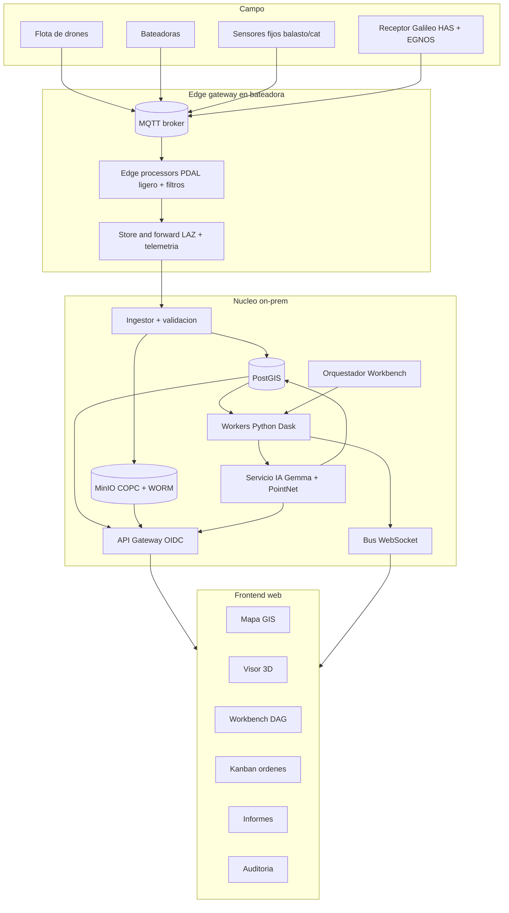
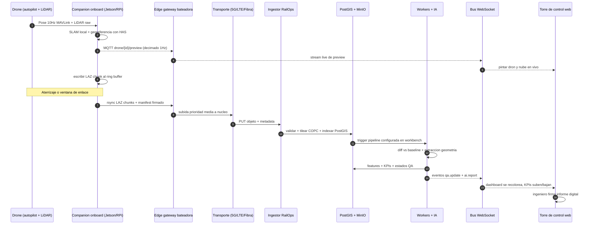
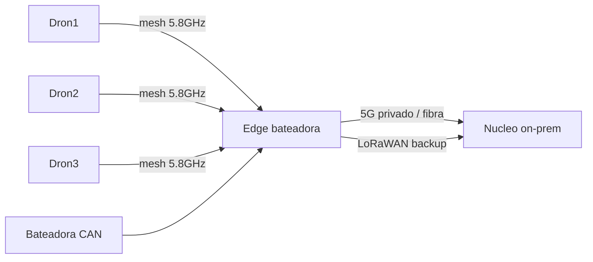
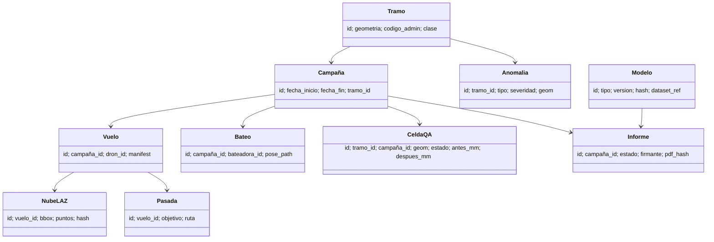
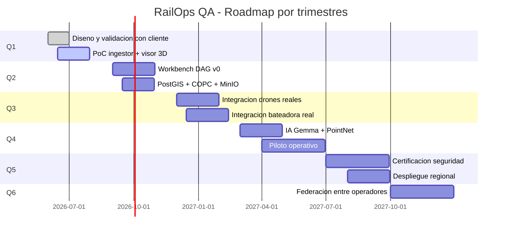

# RailOps QA — Plataforma soberana de calidad de vía (README3)

> **Mirada nueva al problema, sin condicionar por el MVP actual.**
> Este documento responde a dos preguntas:
> 1. ¿Qué problema real existe en el mantenimiento de vía y por qué hoy no
>    se resuelve bien?
> 2. ¿Cómo lo resolvería un **sistema web programable** que aglutine drones,
>    LiDAR, bateadoras, IA, Galileo HAS y torre de control en una sola
>    plataforma soberana?
>
> Nombre de trabajo: **RailOps QA**. Sustitúyelo por el que prefieras.

---

## Índice

1. Diagnóstico del problema real
2. Personas, jornadas y dolor concreto
3. Por qué un MVP tipo “visor + JSON” se queda corto
4. Tesis: plataforma programable, no aplicación monolítica
5. Arquitectura global de RailOps QA
6. Recorrido del dato: del dron a la torre, paso a paso
7. Capa de adquisición (drones, bateadora, sensores fijos)
8. Capa de transporte y borde (Edge, MQTT, mesh, 5G privado)
9. Capa de almacenamiento (PostGIS + COPC + MinIO + WORM)
10. Capa de procesamiento (PDAL, Dask, workers Python)
11. Capa de IA (Gemma local, PointNet++ on-prem, federación opcional)
12. Capa de orquestación: el “Workbench” programable
13. Capa web: mapa, 3D, informes, kanban, auditoría
14. Modelo de datos canónico
15. Seguridad, soberanía y trazabilidad
16. Modelo de despliegue (on-prem, edge, air-gapped)
17. Integraciones externas: ADIF, Galileo HAS, EGNOS, PNOA, MeteoStat
18. KPIs operativos y modelo de éxito
19. Roadmap realista (no 6h, sino 6 trimestres)
20. Riesgos y mitigaciones
21. Estimación de costes y equipo mínimo
22. Cierre: por qué esta plataforma gana

---

## 1. Diagnóstico del problema real

### 1.1 ¿Qué hace hoy un gestor de infraestructura ferroviaria?

- **Mantiene la geometría de vía** dentro de tolerancias definidas por
  normativa (UIC, EN 13848): nivelación, alineación, peralte, ancho.
- **Programa bateadoras** que corrigen esa geometría, pero…
- **Mide poco y mal antes y después**: vagón medidor cada N semanas,
  inspecciones visuales caminando la vía, alguna campaña LiDAR puntual.
- **Reacciona** a incidentes (vegetación, robos de balasto, asientos
  diferenciales, defectos de carril) más que **anticiparlos**.

### 1.2 Lista honesta de problemas

| # | Problema | Consecuencia |
|---|----------|--------------|
| 1 | Falta de “ground truth” actualizado de la vía | Decisiones a ciegas o por antigüedad |
| 2 | Ventanas de corte caras y escasas | No se mide cuando se necesita |
| 3 | Datos LiDAR PNOA infrautilizados | Recurso público sin explotación operativa |
| 4 | Tras bateo no hay verificación inmediata | No se cierra el lazo calidad |
| 5 | Informes manuales en PDF | No comparables, no consultables |
| 6 | Herramientas SaaS no soberanas | Bloqueo regulatorio y dependencia |
| 7 | Drones y bateadoras hablan idiomas distintos | Integración cero |
| 8 | IA generativa atada a APIs externas | No usable en operación |
| 9 | Mantenimiento basado en calendario | Coste y riesgo elevados |
| 10 | Pérdida de conocimiento al rotar plantilla | Cada inspección se redescubre |

### 1.3 La frase que resume todo

> *“Sabemos arreglar la vía. No sabemos demostrar, en datos soberanos y en
> tiempo casi real, que la dejamos mejor de lo que estaba.”*

Esto es lo que vamos a resolver.

---

## 2. Personas, jornadas y dolor concreto

### 2.1 Personas

- **Lucía – Jefa de mantenimiento de un sector ferroviario.** Tiene 80 km
  bajo su responsabilidad, 12 bateadas planificadas al trimestre y un
  presupuesto auditado.
- **Javier – Operador de bateadora.** Conduce la máquina y necesita saber
  *qué tramo* y *cuánto* corregir.
- **María – Piloto de dron certificado.** Vuela misiones programadas en
  ventanas seguras.
- **Diego – Ingeniero de inspección.** Firma los informes y responde ante
  la autoridad ferroviaria.
- **Andrés – Director de operaciones regionales.** Quiere KPIs, no
  archivos `.las`.
- **Auditora externa.** Necesita poder revisar cualquier decisión meses
  después.

### 2.2 Jornada típica HOY vs jornada deseada

```text
HOY:
  Lucía -> Excel -> radio -> Javier
  Javier -> bateo -> "ok jefa" -> Lucía -> Word -> PDF
  3 meses después: vagón medidor mide algo distinto -> nadie sabe por qué

DESEADO:
  Lucía abre el navegador, ve el tramo en rojo
  Programa misión de drones desde la propia plataforma
  La bateadora recibe orden con coordenadas y tolerancias
  Tras el paso, dashboard muestra mm recuperados
  Diego firma el informe digital con un click
  Auditora consulta el mismo informe 18 meses después
```

---

## 3. Por qué un MVP tipo “visor + JSON” se queda corto

El MVP actual demuestra el concepto, pero como herramienta operativa tiene
techo bajo:

- Trabaja con **un tile LAZ a la vez**, no con un sector.
- No tiene **modelo de tiempo**: no compara campañas, no traza historial.
- No gestiona **trabajos**: no hay órdenes, no hay roles, no hay firma.
- Es un **monolito de demo**: si quieres añadir un sensor nuevo, hay que
  parchear código en vez de configurar.
- No habla con **drones reales** ni con bateadoras reales.
- No es **programable** por el cliente final.

> Conclusión: necesitamos una **plataforma**, no una *demo*.

---

## 4. Tesis: plataforma programable, no aplicación monolítica

### 4.1 Principios

1. **Programable por el cliente final**: las pipelines de QA se componen en
   un workbench web tipo nodos, sin tocar código.
2. **Soberana de extremo a extremo**: datos, modelos, dependencias y
   despliegue 100% controlables on-prem o air-gapped.
3. **Tiempo real cuando hace falta, batch cuando no**: streaming para
   monitorizar, ETL para auditar.
4. **Abierta a todos los sensores**: si emite datos posicionales o de
   estado, encaja.
5. **Audit-first**: cada celda QA, cada decisión, cada PDF tiene linaje
   completo.
6. **Edge-aware**: lo que se puede calcular en la bateadora o en el dron,
   no se sube a la nube interna.

### 4.2 Comparativa rápida

| Eje | MVP actual | RailOps QA |
|-----|-----------|------------|
| Alcance | 1 tile LAZ | Red completa |
| Tiempo | Foto fija | Histórico + tiempo real |
| Usuarios | 1 técnico | Equipos multidisciplinares |
| Extensible | No | Workbench de nodos |
| Comunicaciones | Ninguna real | MQTT/gRPC/WS/LoRa |
| IA | Heurística | Gemma + PointNet++ + federada |
| Auditoría | Manual | WORM + firma + linaje |

---

## 5. Arquitectura global de RailOps QA

### 5.1 Vista a vuelo de pájaro



### 5.2 Capas y responsabilidades

| Capa | Responsabilidad | Tecnología sugerida |
|------|-----------------|---------------------|
| Adquisición | Capturar datos en campo | MAVLink, NMEA, CAN bus |
| Edge | Pre-proceso y buffer | Python, PDAL ligero, K3s |
| Transporte | Llevar datos al núcleo | MQTT, gRPC, rsync |
| Almacenamiento | Persistir y versionar | PostGIS, MinIO, COPC, WORM |
| Procesamiento | Convertir a información | PDAL, Dask, Numpy |
| IA | Explicar y predecir | Ollama (Gemma), PointNet++ |
| Orquestación | Componer pipelines | Workbench DAG propio o n8n self-hosted |
| API | Acceso uniforme | FastAPI + OpenAPI + GraphQL opcional |
| Web | Experiencia de usuario | React + MapLibre + Three.js / Cesium |
| Auth | Identidad sobera | Keycloak |
| Observabilidad | Operar la plataforma | Prometheus + Loki + Grafana |

---

## 6. Recorrido del dato: del dron a la torre, paso a paso

> Esta es la parte que el usuario ha pedido en detalle. Aquí va sin
> atajos.

### 6.1 Diagrama de secuencia completo



### 6.2 Detalle por tramo

#### 6.2.1 Dron → Companion (a bordo del dron)

- LiDAR (p. ej. Livox Mid-360 o Velodyne VLP-16) emite puntos a 100–200 kHz.
- IMU + receptor GNSS multibanda con corrección Galileo HAS PPP.
- Companion ejecuta:
  - **SLAM ligero** (FAST-LIO o LIO-SAM) para consolidar pose y nube.
  - **Georeferencia** con HAS para pasar la nube a ETRS89/UTM30N.
  - Escribe **LAZ chunks** cada N segundos al disco local (ring buffer
    8–32 GB).
  - Calcula **decimación** a 1 punto por m² para preview en vivo.

#### 6.2.2 Companion → Edge gateway (en la bateadora)

- Canal A (live): MQTT QoS 1, topic `drone/{id}/preview`, payload binario
  compacto (Protobuf), 1 Hz. Sirve para ver al dron desde la torre **sin
  esperar** al fin de misión.
- Canal B (bulk): cuando hay enlace estable (mesh 5.8 GHz o tras
  aterrizar), **rsync** o gRPC streaming sube los `.laz` con un manifest
  firmado (`sha256 + Ed25519`).

#### 6.2.3 Edge gateway → Núcleo on-prem

- El gateway de la bateadora actúa como **cabeza de puente**.
- Hace **store-and-forward**: si la conexión cae, encola y reintenta.
- Usa 5G privado / LTE corporativo / fibra trackside según disponibilidad.
- Cifrado TLS 1.3 + mTLS.

#### 6.2.4 Ingestor → Almacenamiento

- Valida firmas y checksums.
- Crea **tiles COPC** (Cloud Optimized Point Cloud) en MinIO.
- Inserta metadatos en PostGIS: bounding box, número de puntos, sensor,
  campaña, tramo, hash, autor.
- Marca objetos como **WORM** (Write Once Read Many) cuando se firman.

#### 6.2.5 Procesamiento

- Trigger automático (configurable en workbench): “si llega LAZ en tramo
  X, ejecuta pipeline `qa_post_bateo`”.
- La pipeline encadena nodos: ROI → filtro vegetación → eje de vía →
  comparación con baseline → cálculo de error residual → generación de
  informe IA.

#### 6.2.6 Núcleo → Torre

- Eventos publicados al bus WebSocket: `qa.update`, `drone.pose`,
  `tamper.pose`, `anomaly.detected`, `ai.report`.
- La torre se actualiza en vivo: mapa, 3D, KPIs, kanban de órdenes.

### 6.3 Latencias objetivo

| Salto | Objetivo | Cómo se mide |
|-------|----------|--------------|
| LiDAR → preview en torre | < 2 s | timestamp en MQTT vs reloj UI |
| Aterrizaje → LAZ en MinIO | < 5 min para vuelos < 15 min | logs ingestor |
| LAZ → informe IA firmable | < 15 min | logs pipeline + audit |
| Anomalía crítica → alerta | < 10 s | latencia bus + UI |

---

## 7. Capa de adquisición

### 7.1 Drones

- Mínimo **3 drones** por bateadora (redundancia + cobertura).
- Pasadas tipo P1 (nadir), P2/P3 (laterales 30°), P4 (revisita adaptativa).
- Autopilot Pixhawk + companion Jetson Nano/Orin.
- Misiones planificadas desde el workbench web.

### 7.2 Bateadora

- CAN bus interno expuesto a un módulo lector.
- Pose mediante referencia rígida + GNSS HAS + IMU industrial.
- Publica `tamper.pose`, `tamper.status`, `tamper.work` (carga real).

### 7.3 Sensores fijos

- Inclinómetros en obras singulares.
- Cámaras térmicas en pasos críticos.
- Estaciones meteo (lluvia, viento) que condicionan vuelos.

### 7.4 Receptor GNSS

- Multibanda E1+E5a+E6 para Galileo + HAS.
- Integridad vía EGNOS.
- Tiempo común a toda la flota mediante PTP/NTP servidor en gateway.

---

## 8. Capa de transporte y borde

### 8.1 Topología de red en campo



### 8.2 Reglas de calidad de servicio

- **Telemetría crítica** (pose, alertas): QoS alta, ancho < 100 kbps.
- **Preview LiDAR**: QoS media, ancho 1–3 Mbps.
- **LAZ bulk**: QoS baja diferida, ancho oportunista hasta 100 Mbps.

### 8.3 K3s en el borde

- Mismas imágenes Docker que en el núcleo, sólo cambia la configuración.
- Permite **desplegar pipelines en el borde** sin reescribir nada.
- Sincronización con GitOps (Argo CD o Flux) cuando hay red.

---

## 9. Capa de almacenamiento

### 9.1 ¿Qué guardamos y dónde?

| Dato | Dónde | Por qué |
|------|-------|---------|
| Nubes LAZ originales | MinIO + COPC tiles | acceso aleatorio rápido |
| Features extraídas | PostGIS | consulta espacial |
| KPIs y series temporales | TimescaleDB sobre PostgreSQL | trending |
| Informes firmados | MinIO bucket WORM | cumplimiento |
| Modelos IA | MinIO + checksum | reproducibilidad |
| Logs y trazas | Loki + Tempo | auditoría técnica |

### 9.2 ¿Por qué COPC y no LAZ plano?

- COPC permite leer **sólo la región de interés** sin descomprimir todo.
- Imprescindible cuando manejes terabytes de campañas.
- Estándar abierto (lectura/escritura via PDAL, GDAL).

### 9.3 Política de retención

- **Datos crudos**: 5 años en línea, después archivo frío.
- **Informes firmados**: 25 años (compromiso con autoridad).
- **Series KPI**: indefinido, son baratas.
- **Modelos IA**: cada versión retenida con su hash y dataset.

---

## 10. Capa de procesamiento

### 10.1 Tipos de jobs

1. **Streaming** (segundos): preview, alertas inmediatas.
2. **Near-real-time** (minutos): post-bateo, post-vuelo.
3. **Batch** (horas): consolidaciones nocturnas, comparativas trimestrales.
4. **Ad-hoc** (a demanda): análisis del ingeniero.

### 10.2 Ejemplo de pipeline “qa_post_bateo”

```mermaid
flowchart LR
    A[Trigger objeto LAZ nuevo] --> B[Cargar COPC ROI]
    B --> C[Filtro clase + NIR vegetacion]
    C --> D[Extraccion eje de via]
    D --> E[Calculo cross-section]
    E --> F[Comparar con baseline previo]
    F --> G[Calcular error residual]
    G --> H[Estado QA por celda]
    H --> I[Anomaly detection IA]
    I --> J[Generar informe Gemma]
    J --> K[Publicar eventos + firmar]
```



### 10.3 Tecnología

- **PDAL** para todo lo que es geometría de puntos.
- **Dask** para paralelizar sobre cluster pequeño (4–16 nodos).
- **Numpy/Pandas** para tablas y métricas.
- **PostGIS** para consultas espaciales (`ST_DWithin`, `ST_Intersects`).

---

## 11. Capa de IA

### 11.1 Doble vía: simbólica + estadística

- **Simbólica/heurística**: reglas explícitas (vegetación si NIR>umbral,
  vía si plataforma + RGB neutro), siempre auditable.
- **Estadística**: modelos entrenados sobre datos propios.

### 11.2 Modelos previstos

| Modelo | Tarea | Despliegue |
|--------|-------|------------|
| Gemma local (Ollama) | Explicar informes, redactar resúmenes, contestar al jurado/cliente | CPU/GPU del nodo IA |
| PointNet++ on-prem | Segmentación semántica de nube (rail / balasto / vegetación / catenaria) | GPU dedicada |
| LightGBM | Predicción de aparición de defectos a 90 días | CPU |
| Detector YOLOv8 sobre ortofoto | Localización de elementos fijos | GPU |

### 11.3 Federación opcional (futuro)

- Modelos compartidos entre operadores ferroviarios sin compartir datos
  crudos.
- Solo se intercambian **gradientes/parámetros** firmados.

### 11.4 Política IA generativa

- **Runtime**: solo modelos locales descargados y versionados.
- **Desarrollo**: asistentes (Copilot/ChatGPT/Claude) permitidos y
  declarados con porcentaje aproximado.
- **Cero llamadas externas en producción**, verificable cortando red.

---

## 12. Capa de orquestación: el Workbench

### 12.1 ¿Qué es?

Un **editor visual de pipelines** dentro del navegador. El usuario coloca
nodos, los conecta, los configura, y la pipeline queda **persistida y
versionada** como YAML/JSON.

### 12.2 Inspiración

- n8n / Node-RED / Airflow / KNIME, pero ferroviario y soberano.
- El motor por debajo puede ser **Prefect** o **Dagster** o uno propio
  ligero.

### 12.3 Tipos de nodos

| Categoría | Ejemplos |
|-----------|----------|
| Sources | LAZ MinIO, COPC tile, drone preview, tamper telemetry, PostGIS query |
| Filters | ROI, semantic, NIR, classification, time window |
| Geometry | Rail axis, cross-section, density grid, anomaly detector |
| AI | Gemma summarize, PointNet segment, LightGBM forecast |
| Sinks | PostGIS table, MinIO object, MQTT topic, WebSocket event, PDF report |
| Control | If/else, loop, schedule, manual approval |

### 12.4 Ejemplo visual

```text
[Source: LAZ nuevo]──▶[Filter: ROI tramo 12]──▶[Geometry: rail axis]──▶
[Compare: baseline 2025Q4]──▶[AI: explica diff]──▶[Sink: informe PDF]
                                              └──▶[Sink: alerta MQTT si Δ>5mm]
```

### 12.5 Por qué importa al cliente final

- **Lucía cambia umbrales sin esperar a un release de software.**
- **Diego firma siempre el mismo flujo, trazable.**
- **Andrés ve qué pipelines están activas y cuánto cuestan en cómputo.**

---

## 13. Capa web

### 13.1 Estructura del frontend

```text
/app
  /map        MapLibre + capas vectoriales + raster PNOA + nubes COPC
  /scene      Visor 3D Three.js o Cesium con drones, bateadora, anomalías
  /workbench  Editor DAG drag and drop
  /orders     Kanban de ordenes de trabajo
  /reports    Listado e historico de informes firmados
  /audit      Linaje de cualquier dato o decision
  /admin      Roles, permisos, dispositivos, modelos IA
```

### 13.2 Principios UX

- **Una pantalla por persona** (Lucía, Javier, Diego, Andrés).
- **Modo oscuro alto contraste** para uso en cabina.
- **Cero modal pop-ups**; toda acción es trazable y deshacible.
- **Atajos de teclado** y vista táctil.

### 13.3 Tiempo real

- Suscripción WebSocket a topics relevantes según la página.
- Re-pintado incremental, nunca recarga completa.
- Indicador visible de “datos en vivo” vs “snapshot”.

---

## 14. Modelo de datos canónico

### 14.1 Entidades principales



### 14.2 Identificadores

- UUID v7 en todas las entidades (ordenable temporalmente).
- Códigos administrativos de tramo (heredados de ADIF) como índice
  secundario.

### 14.3 Versionado

- Cualquier informe referencia el **hash exacto** de:
  - Modelo IA usado.
  - Pipeline (YAML).
  - Datos de entrada.
- Reconstruible para auditoría.

---

## 15. Seguridad, soberanía y trazabilidad

### 15.1 Soberanía

- **Datos**: PNOA + propios; nada sale del CPD interno.
- **Modelos**: Gemma + propios; pesos almacenados localmente.
- **Dependencias**: mirror interno de paquetes (PyPI mirror + npm mirror).
- **Despliegue**: on-prem o air-gapped; opción de salir si el cliente
  cambia de hosting.
- **Auditabilidad**: cada informe trazable hasta byte de origen.

### 15.2 Seguridad

- **Auth**: OIDC con Keycloak; MFA obligatorio para roles que firman.
- **Autz**: RBAC + ABAC por tramo geográfico.
- **Red**: segmentación (VLAN campo, VLAN ingestor, VLAN aplicación).
- **Cifrado**: TLS 1.3 en tránsito, AES-256 en reposo, mTLS entre
  servicios.
- **Secretos**: Vault (HashiCorp o un OSS equivalente sobera).

### 15.3 Cumplimiento

- ENS (España), ISO 27001 alineado.
- Regla 4 ojos para firmar informes con impacto operativo.
- WORM para cualquier evidencia entregable a la autoridad.

---

## 16. Modelo de despliegue

### 16.1 Núcleo on-prem

- 3 nodos Kubernetes (control plane + workers), 2 GPUs.
- 50 TB iniciales en MinIO con compresión.
- PostgreSQL+PostGIS con replicación síncrona.
- Backups cifrados a una segunda ubicación física.

### 16.2 Edge

- 1 mini-PC industrial por bateadora (DIN rail, fanless).
- 1 mini-PC por punto fijo crítico.
- 1 SBC (Jetson) por dron.

### 16.3 Modo air-gapped

- Sin internet: los modelos se actualizan vía soporte físico firmado.
- Toda telemetría queda en el CPD del operador.

### 16.4 Observabilidad

- Prometheus + Loki + Tempo + Grafana.
- SLOs definidos:
  - Disponibilidad ingestor: 99.5%.
  - Latencia preview: p95 < 2 s.
  - Tiempo a informe: p90 < 15 min.

---

## 17. Integraciones externas

| Sistema | Qué nos da | Cómo se integra |
|---------|------------|-----------------|
| **ADIF** asset registry | Tramos, kilometraje, clase | API/FTP firmada |
| **Galileo HAS** | Correcciones PPP | Receptor + decoder |
| **EGNOS** | Integridad | Mismo receptor |
| **PNOA LiDAR** | Línea base aérea | Descarga programada + COPC |
| **AEMET** | Meteo para planificación de vuelos | API pública |
| **CECAF / dronemap** | Restricciones aéreas | Plug-in en planificador |

> Importante: cualquier integración externa pasa por el “airlock”: la
> plataforma sigue funcionando aunque caigan estas fuentes.

---

## 18. KPIs operativos

### 18.1 KPIs técnicos

- **mm recuperados** acumulado por trimestre por tramo.
- **Cobertura LiDAR** (km × pasadas) por bateo.
- **Latencia P95** preview / informe.
- **Tasa de anomalías** detectadas vs confirmadas.
- **Precisión del modelo de segmentación** sobre dataset propio.

### 18.2 KPIs de negocio

- **Coste por km inspeccionado** vs línea base manual.
- **Reducción de incidencias** atribuibles a mantenimiento programado.
- **Tiempo desde detección a corrección**.
- **% informes firmados sin retrabajo**.

### 18.3 KPIs soberanía

- **% de tráfico que cruza la frontera** del CPD (objetivo: 0% en
  runtime).
- **% de dependencias con mirror interno**.
- **Modelos IA cuyos pesos están bajo control del operador**.

---

## 19. Roadmap realista (6 trimestres)



### 19.1 Equipo mínimo

- 1 Product Owner ferroviario.
- 2 ingenieros backend Python/Geo.
- 1 ingeniero frontend React.
- 1 ingeniero datos / MLOps.
- 1 SRE/DevOps on-prem.
- 1 ingeniero de campo (integraciones reales).
- 1 UX con experiencia industrial.

### 19.2 Hitos críticos

- Q2: primer informe firmado generado por el sistema sobre datos reales.
- Q3: primer cierre de ciclo completo dron→bateadora→informe.
- Q4: primer piloto en tramo real con ADIF como observador.
- Q6: federación o cierre del proyecto, según éxito.

---

## 20. Riesgos y mitigaciones

| Riesgo | Probabilidad | Impacto | Mitigación |
|--------|--------------|---------|------------|
| Integración con bateadora real bloqueada | media | crítico | empezar con simulador CAN + acuerdo fabricante temprano |
| Falta de dataset etiquetado para PointNet++ | alta | alto | etiquetado activo desde Q1; usar heurística + IA generativa para acelerar |
| Restricciones de vuelo de drones | alta | medio | drones cautivos + corredores autorizados; planificador con CECAF |
| Cliente exige cloud externo | baja | alto | arquitectura soporta nube soberana europea; nunca SaaS USA |
| Coste GPU dispara TCO | media | medio | empezar con CPU para Gemma 4B; GPU solo donde aporta |
| Adopción interna lenta | alta | alto | un “embajador” por sector, formación in situ, vistas por persona |

---

## 21. Estimación de costes (orden de magnitud)

> Sólo indicativos, deben ajustarse con números del cliente.

| Concepto | Año 1 | Año 2 |
|----------|-------|-------|
| Equipo (7 FTE) | ~700 k€ | ~750 k€ |
| Infraestructura on-prem | ~150 k€ CAPEX | ~30 k€ OPEX |
| Drones + sensores piloto | ~120 k€ | ~50 k€ |
| Auditoría y certificación | ~40 k€ | ~60 k€ |
| Formación y soporte | ~30 k€ | ~50 k€ |
| **Total** | **~1.04 M€** | **~0.94 M€** |

Comparado con el coste actual de inspección manual y bateos no
optimizados, el retorno se sitúa en 2–3 años en una red regional.

---

## 22. Cierre: por qué esta plataforma gana

1. **Resuelve el problema real**: cerrar el lazo medir-decidir-corregir-medir
   con datos soberanos.
2. **Aglutina herramientas** existentes (PNOA, Galileo, drones, bateadora,
   Gemma) en una sola experiencia programable.
3. **Es escalable**: de un tramo a una red completa sin reescribir nada.
4. **Es auditable**: cada decisión es defendible años después.
5. **Es soberana de verdad**: pasa el test del cable de red desenchufado.
6. **Es del cliente final**: las pipelines se editan en el workbench, no
   en pull requests.

> **Mantra de la plataforma**:
> *“Lo que la vía nos dice en puntos LiDAR, RailOps lo convierte en
> decisiones firmadas, sin salir de casa.”*

---

### Apéndice A — Comparativa rápida con README2.md

| Aspecto | README2 (hackathon 6h) | README3 (plataforma) |
|---------|-----------------------|----------------------|
| Horizonte | 1 día | 6 trimestres |
| Alcance | MVP demo | Producto operacional |
| Drones | Simulados | Reales con MAVLink |
| LiDAR | 1 tile LAZ | Catálogo COPC vivo |
| IA | Gemma local + heurística | Gemma + PointNet++ + LightGBM |
| Almacenamiento | Ficheros JSON | PostGIS + MinIO + WORM |
| Programabilidad | Código | Workbench DAG |
| Auditoría | Manual | Linaje completo |
| Coste | 0 € | ~1 M€/año |

### Apéndice B — Glosario

- **COPC**: Cloud Optimized Point Cloud.
- **WORM**: Write Once Read Many (almacenamiento inmutable).
- **HAS**: High Accuracy Service de Galileo.
- **EGNOS**: capa europea de aumentación e integridad.
- **PNOA**: Plan Nacional de Ortofotografía Aérea.
- **PDAL**: Point Data Abstraction Library.
- **K3s**: distribución ligera de Kubernetes para edge.
- **PointNet++**: arquitectura de red neuronal para nubes de puntos.
- **mTLS**: TLS mutuo (autenticación cliente y servidor).
- **OIDC**: OpenID Connect.

### Apéndice C — Próximo paso si esto te encaja

1. Validar el problema con 2–3 personas reales del cliente (Lucía, Diego).
2. Cerrar alcance del **piloto Q1–Q2** sobre 1 tramo y 1 bateadora.
3. Firmar acuerdos de acceso a CAN bus y a datos PNOA enriquecidos.
4. Arrancar el workbench y el ingestor antes de la primera campaña real.
5. Iterar con un “embajador” por sector durante 6 meses.

---

*Documento vivo. Cualquier cambio relevante se versiona en `docs/decisions/`*
*como ADR (Architecture Decision Record).*
